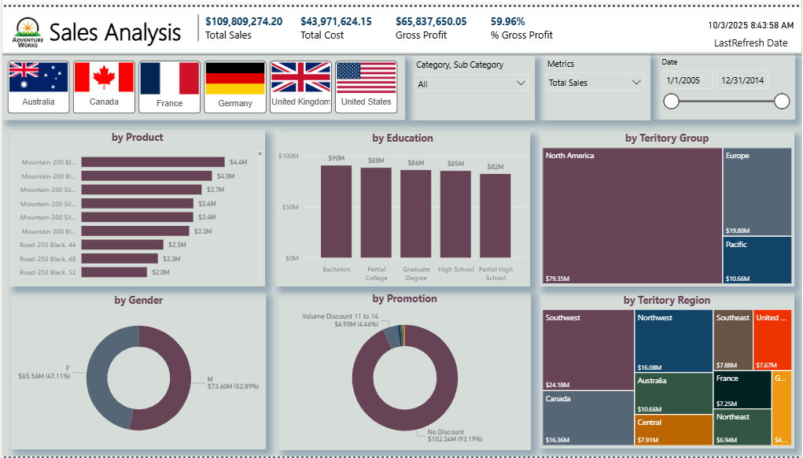
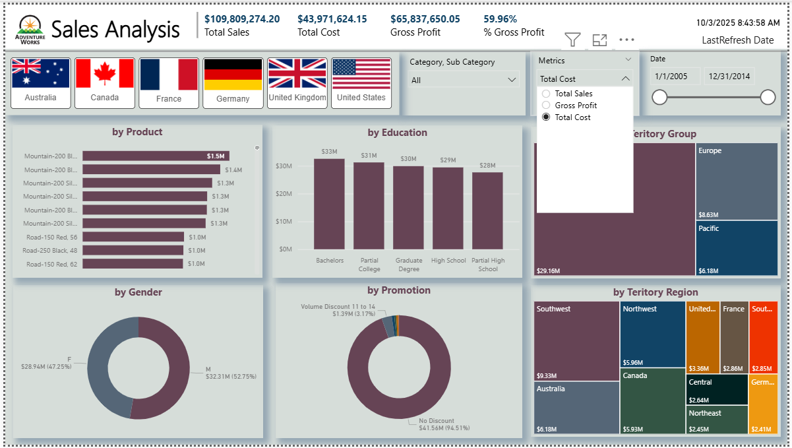
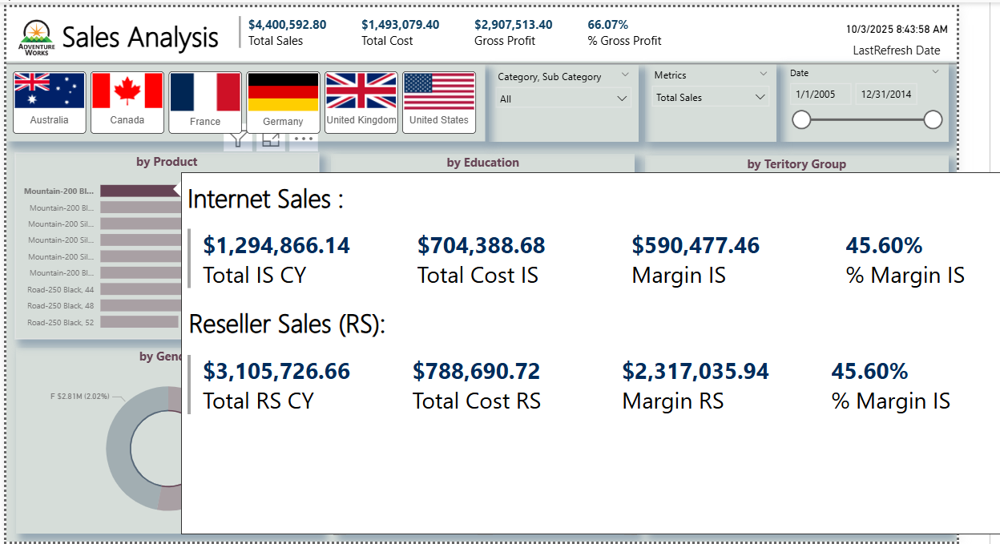

#AdventureWroks Sales Analysis Dashboard

This dashboard was created as part of my learning journey through a **Power BI online course on Udemy**.  
It’s an interactive project designed to explore different Power BI features such as parameters, tooltips, and custom visuals.

---

## 📊 Overview

The dashboard visualizes sales performance data using several interactive features.  
I learned how to use parameters to switch between metrics, add dynamic tooltips, and apply flag-based filters to make the report more intuitive and engaging.

---

## 🔹 Key Features

### 1. Dynamic Metrics
A parameter is used to switch between three main measures:
- **Total Sales**
- **Total Cost**
- **Gross Profit**

All visuals automatically update when a different measure is selected, allowing users to view the same analysis from different perspectives.

### 2. Tooltip Page
A separate tooltip page provides additional details when hovering over visuals.  
It shows a breakdown between Internet and Reseller sales, including totals, costs, and profit margins.

### 3. Country Filter with Flag Slicers
Implemented using the **Chiclet Slicer** visual.  
Each country is represented by its flag, and users can select multiple countries for comparison.

### 4. Interactive Filtering
Users can combine filters and slicers to explore sales insights in a more flexible way.

---

## 🖼️ Screenshots

### Dashboard with “Total Sales” Metric

### Detail of Metric

### Tooltip Page (Internet vs Reseller Sales)

---

## 📈 Visuals Included
- Sales by Product  
- Sales by Region  
- Sales by Customer Demographics  
- Sales by Promotion Type  
- KPI cards showing Total Sales, Total Cost, Gross Profit, and % Gross Profit  

---

## 🧩 Tools Used
- **Power BI Desktop**
- **Chiclet Slicer** custom visual
- **DAX** measures and parameters
- Custom **tooltip page**

---

## 🧠 Skills Practiced
- Creating parameters to switch measures dynamically  
- Building tooltips for detailed data exploration  
- Using custom visuals (Chiclet Slicer)  
- Designing interactive and user-friendly dashboards  

---

## 📚 Data Source
The data used in this project was provided as part of a **Power BI Udemy online course** and is used for **learning and demonstration purposes only**.

---

## 👩‍💻 Created by
**Ardiansari Resti**  
Data Visualization Enthusiast | Power BI Learner
